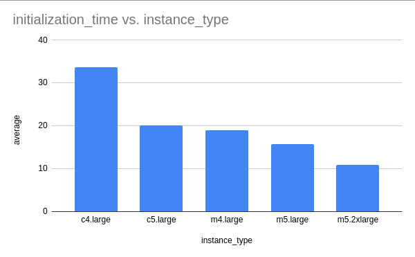
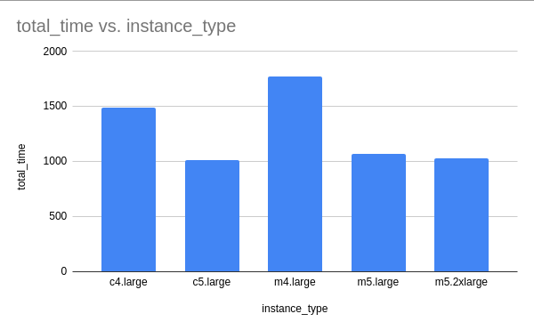
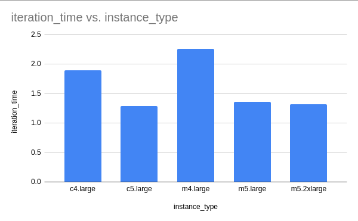

# HPC - Atividade 7 - Experimento 1

- Data: 16 de maio de 2021
- Autor: Daniel De Lucca <delucca@pm.me>

* [HPC - Atividade 7 - Experimento 1](#)
  * [Objetivo](#objetivo)
  * [Metodologia](#metodologia)
  * [Resultados obtidos](#resultados-obtidos)
  * [Conclusão](#conclusao)

## Objetivo

Neste experimento iremos avaliar a relação custo-benefício entre diversas máquinas da AWS para nossa rede adversária. Com base nesta análise será possível tomarmos decisões mais assertivas em relação ao tipo de instância para nossa aplicação.

## Metodologia

Para este experimento, iremos fazer a análise nas seguintes instâncias da AWS:

* c4.large
* c5.large
* m4.large
* m5.large
* m5.2xlarge

A escolha dessas instância foi pautada em suas características e diferenças, mas também na limitação ao qual nossa conta da AWS Educate impõe referente a instâncias disponíveis. A análise das instâncias foi feita com base no relatório técnico da Universidade Estadual de Campinas, onde Borin et al. (2021) demonstram um modelo para a comparação do custo entre duas instâncias de cloud. Iremos utilizar esse modelo durante nossas análises. Todos os experimentos foram executados apenas com dois nós, utilizando o MPI como protocolo para paralelização.

Para a coleta dos dados, foi utilizado uma imagem contendo a instalação de nossa aplicação, bem como o script localizado em *bin/launch-experiment*, que inicializa e executa seu experimento, salvando todos os logs de execução dentro da pasta *results*, no seguinte formato:
```
ativ-7-exp-1
└── results
    ├── c4.large
    │   ├── ip-xxx-rank0.out
    │   └── ip-xxx-rank1.out
    └── ...
```

Sendo `c4.large` o nome da instância que você está utilizando e os arquivos `.out` os logs de execução daquele nó.

Para replicar o experimento, basta executar o script [*run-ativ-7*](./run-ativ-7) passando os argumentos:

* `-m=<ip-main>`
* `-n=<ip-do-no-main>,<ip-do-no-worker>`

## Resultados obtidos

Caso você queira avaliar os resultados de cada uma das instâncias, clique no tipo de instância desejado abaixo:

* [c4.large](./results/c4.large)
* [c5.large](./results/c4.large)
* [m4.large](./results/m4.large)
* [m5.large](./results/m5.large)
* [m5.2xlarge](./results/m5.2xlarge)

Além dos resultados, você pode também avaliar os logs de execução de cada uma das instâncias nas pastas abaixo:

* [c4.large](./logs/c4.large)
* [c5.large](./logs/c4.large)
* [m4.large](./logs/m4.large)
* [m5.large](./logs/m5.large)
* [m5.2xlarge](./logs/m5.2xlarge)
> Dentro dos logs de execução há informações sobre o ambiente de cada uma das instâncias que executaram os testes

Os resultdos consolidados e tratados estão localizados na pasta [`results/normalized`](./results/normalized). Dentro dessa pasta, agrupamos os resultados nas seguintes categorias:

* [Tempo de inicialização](./results/normalized/initialization-time.csv)
* [Tempo da época](./results/normalized/epoch-time.csv)
* [Tempo total](./results/normalized/total-time.csv)
* [Tempo da iteração](./results/normalized/iteration-time.csv)
* [Custo da instância](./results/normalized/instance-cost.csv)

### Análise dos resultados

Como era esperado, a performance do treinamento é diretamente proporcional aos recursos das instâncias. Na tabela abaixo, inseri alguns gráficos que demonstram as métricas que foram monitoradas, são elas: `Tempo de inicialização`, `Tempo da época`, `Tempo total de treinamento` e `Tempo médio de iteração`

| Tempo de inicialização | Tempo da época | Tempo total de treinamento | Tempo médio de iteração |
:-:-:-:-:
|||||

## Conclusão

*TODO*

## Referências

* BORIN, Edson et al. Selecting efficient VM types to train deep learning models on AWS SageMaker
