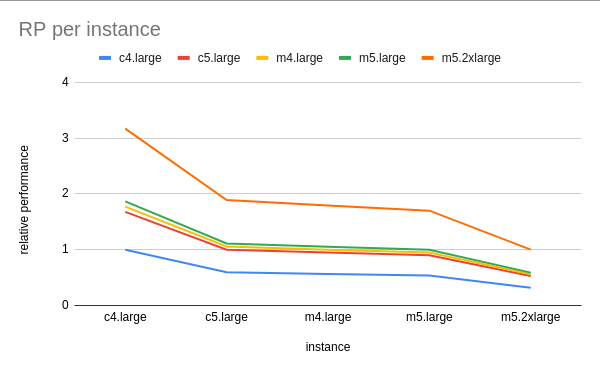
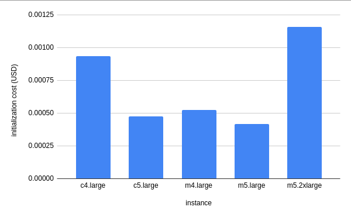
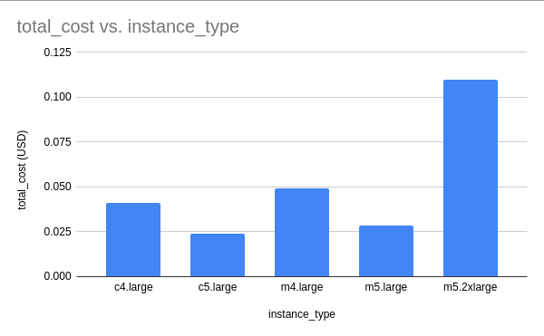
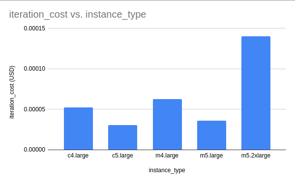

# HPC - Atividade 7 - Experimento 1

- Data: 16 de maio de 2021
- Autor: Daniel De Lucca <delucca@pm.me>

* [HPC - Atividade 7 - Experimento 1](#)
  * [Objetivo](#objetivo)
  * [Metodologia](#metodologia)
  * [Resultados obtidos](#resultados-obtidos)
  * [Conclusão](#conclusao)

## Objetivo

Neste experimento iremos avaliar a relação custo-benefício entre diversas máquinas da AWS para nossa rede adversária. Com base nesta análise será possível tomarmos decisões mais assertivas em relação ao tipo de instância para nossa aplicação.

## Metodologia

Para este experimento, iremos fazer a análise nas seguintes instâncias da AWS:

* c4.large
* c5.large
* m4.large
* m5.large
* m5.2xlarge

A escolha dessas instância foi pautada em suas características e diferenças, mas também na limitação ao qual nossa conta da AWS Educate impõe referente a instâncias disponíveis. A análise das instâncias foi feita com base no relatório técnico da Universidade Estadual de Campinas, onde Borin et al. (2021) demonstram um modelo para a comparação do custo entre duas instâncias de cloud. Iremos utilizar esse modelo durante nossas análises. Todos os experimentos foram executados apenas com dois nós, utilizando o MPI como protocolo para paralelização.

Para a coleta dos dados, foi utilizado uma imagem contendo a instalação de nossa aplicação, bem como o script localizado em *bin/launch-experiment*, que inicializa e executa seu experimento, salvando todos os logs de execução dentro da pasta *results*, no seguinte formato:
```
ativ-7-exp-1
└── results
    ├── c4.large
    │   ├── ip-xxx-rank0.out
    │   └── ip-xxx-rank1.out
    └── ...
```

Sendo `c4.large` o nome da instância que você está utilizando e os arquivos `.out` os logs de execução daquele nó.

Para replicar o experimento, basta executar o script [*run-ativ-7*](./run-ativ-7) passando os argumentos:

* `-m=<ip-main>`
* `-n=<ip-do-no-main>,<ip-do-no-worker>`

## Resultados obtidos

Caso você queira avaliar os resultados de cada uma das instâncias, clique no tipo de instância desejado abaixo:

* [c4.large](./results/c4.large)
* [c5.large](./results/c4.large)
* [m4.large](./results/m4.large)
* [m5.large](./results/m5.large)
* [m5.2xlarge](./results/m5.2xlarge)

Além dos resultados, você pode também avaliar os logs de execução de cada uma das instâncias nas pastas abaixo:

* [c4.large](./logs/c4.large)
* [c5.large](./logs/c4.large)
* [m4.large](./logs/m4.large)
* [m5.large](./logs/m5.large)
* [m5.2xlarge](./logs/m5.2xlarge)
> Dentro dos logs de execução há informações sobre o ambiente de cada uma das instâncias que executaram os testes

Os resultdos consolidados e tratados estão localizados na pasta [`results/normalized`](./results/normalized). Dentro dessa pasta, agrupamos os resultados nas seguintes categorias:

* [Tempo de inicialização](./results/normalized/initialization-time.csv)
* [Tempo da época](./results/normalized/epoch-time.csv)
* [Tempo total](./results/normalized/total-time.csv)
* [Tempo da iteração](./results/normalized/iteration-time.csv)
* [Custo da instância](./results/normalized/instance-cost.csv)

### Análise dos resultados

Como era esperado, dentro das instâncias do mesmo time (`c` ou `m`), as médias das métricas que avaliamos é decresce de acordo com a quantidade de recursos da instância. Abaixo, vemos um gráfico comparando as médias das seguintes métricas: `Tempo de inicialização`, `Tempo da época`, `Tempo total de treinamento` e `Tempo médio de iteração`

<table>
  <tr>
   <td>Tempo de inicialização</td>
   <td>Tempo da época</td>
   <td>Tempo total de treinamento</td>
   <td>Tempo médio de iteração</td>
  </tr>
  <tr>
    <td></td>
    <td></td>
    <td></td>
    <td></td>
  </tr>
</table>

Observamos que os tempos de inicialização decrescem de forma linear. Mesmo quando colocamos lado a lado instâncias do tipo `c` e `m`, que notoriamente possuem objetivos diferentes. Vemos também que as instâncias do tipo `m` possuem uma performance muito superior no tempo de inicialização.

Com base em Borin et al. (2021), podemos descobrir a performance relativa entre duas instâncias através do tempo médio de suas iterações. Deste modo, aplicando a equação


Chegamos nos seguintes resultados por par de instâncias:


*Gráfico de análise de performance relativa por instância*

Neste gráfico, confirmamos o resultado esperado de que a performance relativa é proporcional aos recursos das instâncias, mas há um padrão interessante. Com base no cálculo de performance relativa, vemos que as instâncias `c5.large`, `m4.large` e `m5.large` possuem uma performance muito similar. Há pouca diferença entre a performance destas instâncias.

Por outro lado, ao comparar e verificar o custo de inicialização de cada uma das instância, temos o seguinte cenário:


*Análise do custo de inicialização por instância. Por custo de inicialização consideramos o valor total gasto em dólares na etapa de inicialização do treinamento*

Curiosamente, a máquina com a melhor performance relativa, é também a com maior custo de inicializaçao, enquanto a com a pior performance relativa é a segunda com o maior custo de inicialização.

Além do maior custo de inicialização, quando analisamos o custo de execução total para o treinamento em cada uma das instâncias, vemos claramente que embora a `m5.2xlarge` seja mais performática, sua diferençá de preço é tão expressiva que faz com que seu custo total seja superior.


*Análise do custo total do treinamento em dólares, para um experimento com apenas uma época*

Porém, em todas as análises acimas, vemos o impacto apenas de uma única época. Poderia se argumento que em um treinamento mais longo, essa relação poderia ser diferente, gerando uma economia em determinadas instâncias. No gráfico abaixo mostramos o custo por iteração, e vemos que a mesma relação de custo se mantém.


*Gráfico de análise do custo por iteração por instância, em dólares*

## Conclusão

*TODO*

## Referências

* BORIN, Edson et al. Selecting efficient VM types to train deep learning models on AWS SageMaker
